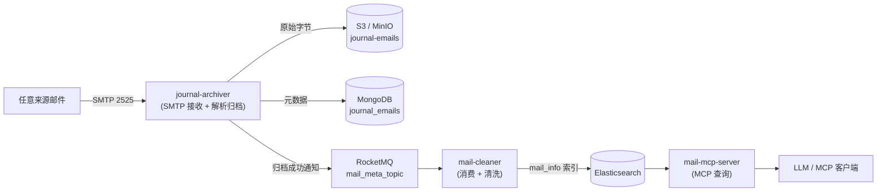

# Gas Town Mail（JDK 17 / Spring Boot 多模块工程）


## 生成声明

本项目代码完全由 DeepSeek V4 生成，并非人工编写。

> **注意**：本项目目前为实验性项目，尚未经过生产环境验证，请谨慎使用。

一个邮件归档与清洗平台，由三个 Spring Boot 3.4.13（JDK 17）应用和一个共享模块组成：

- **journal-archiver（归档应用）**：
  1. 内嵌 SMTP 服务，监听 `0.0.0.0`，接收来自任何来源的邮件；
  2. 识别 **journal 格式**（Exchange journal report）后，把原邮件基础信息写入 **MongoDB**
     （`_id` 为 `Base64(sender)_Base64(Message-Id)`），原邮件原始字节写入 **S3 对象存储**
     （对象 key 与 MongoDB `_id` 相同）；
  3. 两者都成功后向 **RocketMQ** `mail_meta_topic` 发送通知（消息 key 为 MongoDB `_id`）；
  4. 提供 HTTP 接口按时间范围或 `_id` 列表**重发**通知。
- **mail-cleaner（清洗应用）**：
  1. 订阅 RocketMQ `mail_meta_topic`；
  2. 收到消息后从对象存储读取邮件本体，解析出 sender / from / to / cc / Message-Id / ReceivedTime /
     subject / content-type / 所有附件名称，写入 **Elasticsearch** 的 `mail_info` 索引。
- **mail-mcp-server（MCP 查询应用）**：
  1. 基于 Spring MCP 系列依赖（`mcp-spring-webmvc`）提供**标准 MCP Streamable HTTP 接口**（`/mcp`）；
  2. 通过 MCP 工具从 **Elasticsearch** `mail_info` 索引查询归档邮件元数据
     （关键词 / 收发件人 / Message-Id / 时间范围检索、按 id 查询、计数）。

三个应用通过共享模块 **mail-common** 复用邮件解析、S3 读写、ES 文档模型、公共配置等相同逻辑；
所有依赖版本统一在根 POM 的 `dependencyManagement` 中管理。

## 模块结构

```text
gas-town-mail（父 POM：统一依赖版本、编译参数、插件管理）
├── mail-common          共享模块
│   ├── config/          S3Properties、S3Config、JacksonConfig
│   ├── es/              MailInfoDocument（mail_info 索引文档模型，写入/查询共用）
│   ├── mail/            EmailDetailsExtractor、JournalDetector、OriginalEmailExtractor、
│   │                    EmailIdGenerator、MailMetaMessage 等
│   └── storage/         ObjectStorageService（S3 读写/删除）
├── journal-archiver     归档应用（SMTP + MongoDB + S3 + RocketMQ 生产者 + 重发接口）
├── mail-cleaner         清洗应用（RocketMQ 消费者 + S3 读 + Elasticsearch mail_info）
└── mail-mcp-server      MCP 查询应用（Spring MCP 标准接口 + Elasticsearch 查询）
```

## 工作流程



```text
任意来源 --SMTP--> 内嵌 SMTP 服务 (subethasmtp)
                      │ 捕获 MAIL FROM / RCPT TO / DATA 原始字节
                      ▼
              JournalProcessingService（异步线程池）
                      │ 1. 解析 MIME
                      │ 2. 判断是否 journal 格式
                      │ 3. 提取原邮件（优先取 message/rfc822 内嵌部分）
                      │ 4. 提取基础信息并生成 id
                      ▼
        ┌─────────────┬─────────────┐
        ▼             ▼             ▼
      S3:         MongoDB:      RocketMQ:
  journal-     journal_emails  mail_meta_topic
  emails/<id>   { _id: ... }    (两者成功后通知)
        │             │
        └─────┬───────┘
        全部成功后才发送通知；任一步失败会重试，
        最终失败则写入本地死信目录
```

## journal-archiver 工作流程

## 快速开始

### 1. 启动本地依赖（MongoDB + MinIO + RocketMQ + Elasticsearch）

```bash
docker compose up -d
```

> 应用会在启动时尝试自动创建 S3 bucket（默认 `journal-emails`），无需手动建桶。
> RocketMQ 的 topic `mail_meta_topic` 无需提前创建，生产者发送时会自动创建。
> compose 使用了 profile 隔离：**默认 `docker compose up -d` 只启动基础设施**
> （MongoDB / MinIO / RocketMQ / Elasticsearch），三个应用位于 `app` profile 下，需要时再启动。
> 三个应用都随 compose 提供 Dockerfile（多阶段 JDK 17 构建），容器内各服务地址（MongoDB、MinIO、
> RocketMQ、Elasticsearch）已自动指向 compose 中的基础设施服务，无需改配置文件：

> MinIO 默认账号 `minioadmin/minioadmin` 仅用于本地开发，生产环境务必通过
> `S3_ACCESS_KEY` / `S3_SECRET_KEY` 环境变量覆盖。

```bash
docker compose up -d                          # 仅基础设施
docker compose --profile app up -d --build    # 完整栈（基础设施 + 三个应用）
```

> 完整栈端口：SMTP 2525 / journal-archiver 8080 / mail-cleaner 8081 / mail-mcp-server 8082；
> 也可单独启动某个应用，如 `docker compose --profile app up -d --build mail-mcp-server`。

### 2. 构建与启动应用

需要 JDK 17，在项目根目录构建：

```bash
export JAVA_HOME=/path/to/jdk17
./mvnw clean package       # 构建全部模块并运行测试（首次会自动下载 Maven）
```

归档应用（HTTP 8080 / SMTP 2525）：

```bash
java -jar journal-archiver/target/journal-archiver-1.0.0.jar
# 或先安装共享模块到本地仓库，再用 spring-boot:run 调试：
# ./mvnw install -DskipTests
# ./mvnw -pl journal-archiver spring-boot:run
```

清洗应用（HTTP 8081 / 消费 mail_meta_topic）：

```bash
java -jar mail-cleaner/target/mail-cleaner-1.0.0.jar
```

MCP 查询应用（HTTP 8082 / MCP 端点 `/mcp`）：

```bash
java -jar mail-mcp-server/target/mail-mcp-server-1.0.0.jar
```

> MCP 工具的完整参数与调用示例见 [mail-mcp-server/README.md](mail-mcp-server/README.md)（接口文档）。

三个应用都集成了 springdoc（OpenAPI / Swagger UI），接口地址：

| 应用 | OpenAPI JSON | Swagger UI |
| --- | --- | --- |
| journal-archiver（8080） | `http://localhost:8080/v3/api-docs` | `http://localhost:8080/swagger-ui.html` |
| mail-cleaner（8081） | `http://localhost:8081/v3/api-docs` | `http://localhost:8081/swagger-ui.html` |
| mail-mcp-server（8082） | `http://localhost:8082/v3/api-docs` | `http://localhost:8082/swagger-ui.html` |

Swagger UI 可直接在页面上调试 REST 接口（journal-archiver 的重发接口、mail-cleaner 的批量删除接口；
mail-mcp-server 主要暴露标准 MCP 端点 `/mcp`，文档化在 OpenAPI 中）。

> 注意：所有应用都依赖 `mail-common`，请始终从根目录执行 `mvn clean package`（reactor 构建），
> 或用 `java -jar` 直接运行打包产物；不要直接对单个模块执行 `mvn spring-boot:run`（未安装共享模块会解析失败）。

启动日志应包含：

```text
SMTP server started on 0.0.0.0:2525
Created object storage bucket 'journal-emails'
```

### 3. 发送一封测试邮件

使用 [swaks](https://github.com/jetmore/swaks)（或任意 SMTP 客户端）向 `2525` 端口发送
[journal-archiver/src/main/resources/samples/journal-sample.eml](journal-archiver/src/main/resources/samples/journal-sample.eml)：

```bash
swaks --server 127.0.0.1:2525 \
      --from postmaster@corp.local \
      --to journal@archive.local \
      --data journal-archiver/src/main/resources/samples/journal-sample.eml
```

归档成功后日志示例：

```text
Received message via SMTP: client=/127.0.0.1:xxxxx, envelope sender=postmaster@corp.local, ...
Extracted embedded original email (313 bytes)
Saved journal email metadata to MongoDB: id=QWxpY2UgPGFsaWNlQGV4YW1wbGUuY29tPg==_PG9yaWdpbmFsLTEyM0BleGFtcGxlLmNvbT4=
Stored email object s3://journal-emails/QWxpY2UgPGFsaWNlQGV4YW1wbGUuY29tPg==_PG9yaWdpbmFsLTEyM0BleGFtcGxlLmNvbT4=
```

## 配置（application.yml）

| 配置项 | 默认值 | 说明 |
| --- | --- | --- |
| `app.smtp.bind-address` | `0.0.0.0` | 监听地址，`0.0.0.0` 表示所有网卡 |
| `app.smtp.port` | `2525` | SMTP 监听端口 |
| `app.smtp.hostname` | `journal-archiver.local` | EHLO 应答中的主机名 |
| `app.smtp.max-message-size` | `20971520` | 单封邮件大小上限（字节） |
| `app.smtp.max-connections` / `max-recipients` / `connection-timeout-seconds` | 200 / 100 / 60 | 连接与收件人限制 |
| `app.smtp.require-tls` | `false` | 是否强制 TLS |
| `app.smtp.disable-received-headers` | `true` | 为 `true` 时按原样保存收到的字节（不注入 `Received:` 头） |
| `app.journal.detect-by-header` | `true` | 通过 `X-MS-Journal-Report` / `X-MS-Exchange-Organization-Journal-Report` 识别 journal |
| `app.journal.detect-by-rfc822-attachment` | `true` | 通过内嵌 `message/rfc822` 附件识别 journal |
| `app.journal.extract-original-attachment` | `true` | 归档内嵌的原邮件，而不是 journal 外壳 |
| `app.journal.sender-resolution` | `header` | `sender` 字段取值：`header`（Sender 头，缺省回退 From）、`envelope`（SMTP MAIL FROM）、`from`（始终用 From） |
| `app.journal.generate-message-id-if-missing` | `true` | 原邮件缺少 Message-Id 时生成一个，保证 id 唯一 |
| `app.processing.core/max/queue` | 2 / 8 / 500 | 归档处理的线程池参数 |
| `app.processing.retry-max-attempts` | `3` | 归档失败时的最大尝试次数 |
| `app.processing.retry-backoff-ms` | `1000` | 重试间隔（按尝试次数递增） |
| `app.processing.dead-letter-dir` | `./data/dead-letter` | 最终失败邮件的本地落盘目录 |
| `app.resend.max-ids` | `1000` | 重发接口单次允许的最大 ids 数量 |
| `app.resend.parallelism` / `queue-capacity` | 4 / 1000 | 重发任务的线程池参数 |
| `app.notify.rocketmq.enabled` | `true` | 是否发送归档完成通知 |
| `app.notify.rocketmq.name-server` | `127.0.0.1:9876` | RocketMQ NameServer 地址 |
| `app.notify.rocketmq.producer-group` | `journal-archiver-producer` | RocketMQ 生产者组 |
| `app.notify.rocketmq.topic` | `mail_meta_topic` | 通知 topic |
| `app.notify.rocketmq.tag` | `mail-meta` | 通知 tag（置空则只发 topic） |
| `app.notify.rocketmq.send-timeout-ms` | `3000` | 同步发送超时 |
| `app.notify.rocketmq.retry-times-when-send-failed` | `2` | 发送失败时 RocketMQ 客户端内置重试次数 |
| `server.port` | `8080` | HTTP 接口端口 |
| `spring.data.mongodb.uri` | `mongodb://.../journal_archiver?serverSelectionTimeoutMS=10000&connectTimeoutMS=5000` | MongoDB 连接串（含超时配置） |
| `management.endpoints.web.exposure.include` | `health` | 仅暴露健康检查端点 |
| `app.storage.s3.endpoint` / `region` / `access-key` / `secret-key` / `bucket` / `path-style` | MinIO 本地默认值 | S3 兼容对象存储配置 |
| `app.storage.s3.create-bucket-if-missing` | `true` | 启动时自动创建 bucket |

## MongoDB 文档字段

除基础信息（`sender`/`from`/`to`/`cc`/`subject`/`messageId`/`envelopeSender` 等）外，
每次保存都会写入审计字段：

| 字段 | 说明 |
| --- | --- |
| `createdAt` | 数据创建时间（时间戳），首次归档时写入，重复归档同一 id 时保持不变 |
| `updatedAt` | 数据最后修改时间（时间戳），每次保存更新 |
| `modificationCount` | 数据修改次数，首次归档为 `1`，同一 id 再次归档时 +1（Mongo `$inc` 原子自增，无并发计数丢失） |

## 可靠性设计

- **写入顺序**：S3（幂等，同 key 覆盖）→ MongoDB（原子 upsert）→ RocketMQ 通知。
- **补偿**：若 S3 已写入但 MongoDB 写入失败，会尽力删除该 S3 对象，避免“有元数据无原件”的中间态。
- **重试**：整个归档流程最多重试 `retry-max-attempts` 次（默认 3），间隔按尝试次数递增。
- **死信**：重试仍失败时，原始邮件字节和接收上下文（信封发件人、收件人、客户端地址、错误）写入
  `app.processing.dead-letter-dir`（默认 `./data/dead-letter/`，`*.eml` + `*.json`），可手工重放。
- **背压**：归档线程池队列满时使用 `CallerRunsPolicy`（在 SMTP 线程内同步处理），不会粗暴断开连接；
  邮件超过大小上限时返回 SMTP `552`，让发送方知道是被拒绝而不是断连。
- **通知失败**：MongoDB/S3 都成功后通知发送失败只记日志（消息可用重发接口补发）。

## 健康检查

`GET /actuator/health`：包含 MongoDB 健康（默认）和自定义的 SMTP 健康指示器
（[SmtpHealthIndicator.java](src/main/java/com/example/journalarchiver/actuator/SmtpHealthIndicator.java)）。
MongoDB 不可用时整体状态为 `DOWN`（HTTP 503），便于探活与告警。

## HTTP 重发接口

`POST /api/journal-emails/resend`，请求体为 JSON：

```json
{
  "timeGe": "2026-08-16T00:00:00Z",
  "timeLt": "2026-08-17T00:00:00Z",
  "ids": ["id-1", "id-2"]
}
```

参数语义：

- `timeGe`（可选）：数据创建时间 **大于等于** 该值（`createdAt >= timeGe`）；
- `timeLt`（可选）：数据创建时间 **小于** 该值（`createdAt < timeLt`）；
- `ids`（可选）：待重发的 MongoDB `_id` 数组，**优先于**时间参数（提供了 `ids` 就直接用它们，不再按时间查询）。

`ids` 与时间参数都不传时返回 `400`。响应示例：

```json
{
  "total": 2,
  "succeeded": 2,
  "failed": 0,
  "ids": ["id-1", "id-2"],
  "notFoundIds": []
}
```

`ids` 中不存在的文档会进入 `notFoundIds`（同时计入 `failed`），便于调用方区分“发送失败”和“文档不存在”。

调用示例：

```bash
# 按指定 ids 重发
curl -X POST http://localhost:8080/api/journal-emails/resend \
  -H "Content-Type: application/json" \
  -d '{"ids":["id-1","id-2"]}'

# 按创建时间范围重发（左闭右开：[timeGe, timeLt)）
curl -X POST http://localhost:8080/api/journal-emails/resend \
  -H "Content-Type: application/json" \
  -d '{"timeGe":"2026-08-16T00:00:00Z","timeLt":"2026-08-17T00:00:00Z"}'
```

重发时从 MongoDB 读取对应文档，重新生成 `mail_meta_topic` 消息（消息 key 仍为该文档的 `_id`）。
不存在的 id 或发送失败计入 `failed`。

## RocketMQ 通知

归档流水线严格按以下顺序执行：

1. `repository.save(...)` 写入 MongoDB（`_id` = `Base64(sender)_Base64(Message-Id)`）；
2. `objectStorageService.store(id, rawEmail, subject)` 写入 S3（key = 同一个 id）；
3. 两者都成功后，`RocketMailMetaPublisher` 向 `mail_meta_topic:mail-meta` 同步发送 JSON 消息。

消息的 **key（RocketMQ 消息 id）设为 MongoDB 文档 `_id`**（与 S3 对象 key 相同），
消费方可以用该 key 直接定位/去重消息；消息体（`MailMetaMessage`）示例：

```json
{
  "id": "QWxpY2UgPGFsaWNlQGV4YW1wbGUuY29tPg==_PG9yaWdpbmFsLTEyM0BleGFtcGxlLmNvbT4=",
  "sender": "Alice <alice@example.com>",
  "from": "Alice <alice@example.com>",
  "to": "Bob <bob@example.com>",
  "cc": "Carol <carol@example.com>",
  "subject": "Quarterly report",
  "messageId": "<original-123@example.com>",
  "envelopeSender": "postmaster@corp.local",
  "objectKey": "QWxpY2UgPGFsaWNlQGV4YW1wbGUuY29tPg==_PG9yaWdpbmFsLTEyM0BleGFtcGxlLmNvbT4=",
  "receivedAt": "2026-08-16T05:00:00Z"
}
```

其它服务拿到 `id` 后即可用同一个值从 MongoDB 查元数据、从 S3 取原邮件。

> 通知是尽力而为（best-effort）：发送失败只记录 ERROR 日志，不会回滚已经完成的 MongoDB/S3 写入，
> 也不会影响 SMTP 服务。需要严格不丢失时，可在此基础上增加本地重试或事务消息。

## 关键设计说明

### id 格式

```text
Base64(sender)_Base64(Message-Id)
```

例如 `sender = Alice <alice@example.com>`、`Message-Id = <original-123@example.com>` 时：

```text
QWxpY2UgPGFsaWNlQGV4YW1wbGUuY29tPg==_PG9yaWdpbmFsLTEyM0BleGFtcGxlLmNvbT4=
```

该值同时作为 MongoDB 文档 `_id` 和 S3 对象 key（`Content-Type: message/rfc822`）。

### journal 格式识别

Exchange journal report 的典型特征（参考 Microsoft 文档）：

- 带有 `X-MS-Journal-Report` 头（投递到日记邮箱时添加）；
- 或带有 `X-MS-Exchange-Organization-Journal-Report` 头；
- 原始邮件以 `message/rfc822` 内嵌在 `multipart/mixed` 结构中。

默认命中上述任意一条即判定为 journal，可通过配置开关调整。

### “原邮件”的提取

- 若 journal 报告内嵌了 `message/rfc822` 部分，则归档**内嵌原始邮件**的原始字节，基础信息也从它解析；
- 若没有内嵌部分（或关闭 `extract-original-attachment`），则把收到的邮件本身视为原邮件归档。

### sender 与 from 的区别

按 RFC 5322 语义，`sender` 优先取原邮件的 `Sender` 头，缺省回退到 `From` 地址；
SMTP 信封发件人（MAIL FROM）单独存入 MongoDB 的 `envelopeSender` 字段。
如需直接用信封发件人作为 `sender`，可设置 `app.journal.sender-resolution: envelope`。

## mail-cleaner 应用

### 工作流程

```text
RocketMQ mail_meta_topic ──► MailMetaConsumer（DefaultMQPushConsumer）
                                  │ 反序列化 MailMetaMessage（payload + 消息 key）
                                  ▼
                          MailCleaningService
                                  │ 1. 从 S3 读取邮件本体（objectKey = MongoDB id）
                                  │ 2. 解析 MIME：sender/from/to/cc/Message-Id/
                                  │    ReceivedTime/subject/content-type/附件名称
                                  │ 3. 写入 Elasticsearch mail_info（文档 id = objectKey）
                                  ▼
                          成功返回 CONSUME_SUCCESS；
                          失败返回 RECONSUME_LATER（RocketMQ 重投）
```

### Elasticsearch 文档（`mail_info`）

| 字段 | 说明 |
| --- | --- |
| `id` | 归档 id（MongoDB `_id` / S3 对象 key），重复消费同一消息会覆盖同一文档 |
| `sender` / `from` / `to` / `cc` | 地址字段 |
| `messageId` | 原邮件 `Message-Id` |
| `receivedTime` | 原邮件 `Date` 头解析出的时间（ISO-8601） |
| `subject` | 主题（RFC 2047 解码） |
| `contentType` | MIME `Content-Type` |
| `attachmentNames` | 所有附件文件名（含嵌套 multipart） |

### 配置（mail-cleaner/src/main/resources/application.yml）

| 配置项 | 默认值 | 说明 |
| --- | --- | --- |
| `server.port` | `8081` | HTTP/健康检查端口 |
| `spring.elasticsearch.uris` | `http://localhost:9200` | Elasticsearch 地址 |
| `app.rocketmq.name-server` | `127.0.0.1:9876` | RocketMQ NameServer |
| `app.rocketmq.consumer-group` | `mail-cleaner-consumer` | 消费者组 |
| `app.rocketmq.topic` | `mail_meta_topic` | 订阅 topic |
| `app.rocketmq.tag` | `*` | 订阅 tag |
| `app.rocketmq.start-retry-interval-ms` | `30000` | 消费者启动失败后的自动重试间隔 |
| `app.storage.s3.*` | 同归档应用 | 共享的 S3 配置（mail-common） |

应用启动时不依赖 Elasticsearch / RocketMQ 在线（客户端懒连接、消费者启动失败会按固定间隔自动重试，
无需重启）；`/actuator/health` 包含 Elasticsearch 与 RocketMQ 消费者两个健康指示器。
处理失败的消息由 RocketMQ 按消费者组重投，索引缺失时会在下一条消息时自动补建。
`mail_info` 已显式定义映射：地址类字段与附件名为 keyword（精确匹配），主题为 text（全文检索），
时间为 date。

### HTTP 批量删除接口

`POST /api/mail-info/delete`，请求体为 JSON：

```json
{
  "ids": ["id-1", "id-2", "id-3"]
}
```

按 Elasticsearch 文档 id（即归档 id / MongoDB `_id` / S3 对象 key）批量删除 `mail_info` 中的数据。
空值会被忽略、重复 id 会去重；空列表或超过 1000 个 id 时返回 `400`。响应示例：

```json
{
  "requested": 3,
  "deleted": 2,
  "notFoundIds": ["id-3"]
}
```

`deleted` 为实际删除的文档数，`notFoundIds` 为索引中不存在的 id（不计入 `deleted`）。

调用示例：

```bash
curl -X POST http://localhost:8081/api/mail-info/delete \
  -H "Content-Type: application/json" \
  -d '{"ids":["id-1","id-2"]}'
```

## mail-mcp-server 应用

基于 **JDK 17 / Spring Boot 3.4** 的 Spring MCP（Model Context Protocol）服务，
使用 Spring MCP 系列依赖 `io.modelcontextprotocol.sdk:mcp-spring-webmvc` 提供
标准 MCP Streamable HTTP 接口（默认 `POST /mcp`，端口 8082），
让 LLM / MCP 客户端直接查询 Elasticsearch `mail_info` 索引中的归档邮件元数据。

### 工作流程

```text
MCP 客户端（Claude Desktop / Cursor / 任意 MCP SDK）
        │ 标准 MCP 协议（Streamable HTTP，/mcp）
        ▼
    McpSyncServer（mcp-spring-webmvc）
        │ search_mails / get_mail_by_id / count_mails
        ▼
    EmailQueryService
        │ bool query（term 精确过滤 + keyword 全文匹配 + 时间范围）
        ▼
    Elasticsearch mail_info
```

### 暴露的 MCP 工具

| 工具 | 说明 |
| --- | --- |
| `search_mails` | 分页搜索：keyword（subject/sender/from/to/messageId）、精确地址、Message-Id、时间范围 |
| `get_mail_by_id` | 按归档 id（MongoDB `_id` / S3 key）查询单封邮件 |
| `count_mails` | 统计符合条件的邮件数量 |

### 接口文档

- MCP 工具参数、客户端配置与 JSON-RPC 调用示例：[mail-mcp-server/README.md](mail-mcp-server/README.md)；
- 运行时 OpenAPI：`GET /v3/api-docs`，Swagger UI：`GET /swagger-ui.html`（文档化 `/mcp` 端点）。

### 运行

```bash
# 方式一：本地 java -jar（需先 mvn clean package）
java -jar mail-mcp-server/target/mail-mcp-server-1.0.0.jar

# 方式二：docker compose（与基础设施一起，自动连接容器内 Elasticsearch）
docker compose --profile app up -d --build mail-mcp-server
```

> 版本说明：Spring MCP SDK 要求 Spring Framework 6.2+，因此父 POM 的 Spring Boot
> 从 3.3.5 升级到 3.4.13（JDK 17 不变，三个应用版本统一）。

## 测试

```bash
./mvnw test     # 在项目根目录运行，构建全部模块
```

共 86 个测试，按模块分布：

- **mail-common（15）**：id 生成、journal 识别、原邮件提取、邮件详情解析（含中文主题解码、
  ReceivedTime、content-type、附件名）；
- **journal-archiver（37）**：RocketMQ 通知、归档流水线（S3→Mongo→通知顺序、原子 `$inc`、
  S3 失败重试、Mongo 失败补偿删除、缺 Message-Id 自动生成、死信落盘）、重发服务（含缺失 id 统计）、
  HTTP 接口、真实 SMTP 握手端到端测试，以及 SMTP 健康指示器、统一异常处理、`AppProperties`
  配置绑定（含 `name-server` kebab 属性）、RocketMQ producer 装配、SMTP 消息捕获与超限拒绝、
  OpenAPI 元数据；
- **mail-cleaner（21）**：消费成功/失败重投、批量消息部分失败、S3 读取 + 邮件解析 + 写入
  `mail_info` 文档，以及 RocketMQ 健康指示器、`CleanerProperties` 绑定、清洗服务
  （无效载荷、objectKey 读取、索引复用）、批量删除（存在/缺失 id、去重、空请求与数量上限、
  HTTP 400 处理）、OpenAPI 元数据等用例；
- **mail-mcp-server（13）**：ES 查询服务（分页搜索、页大小上限、计数、按 id 查询）、
  MCP 工具（参数解析、默认分页、按 id 查询、计数）、MCP Server 装配、OpenAPI 文档生成。

### 在容器内运行测试

```bash
docker run --rm \
  -v "$(pwd)":/workspace -w /workspace \
  -v "$HOME/.m2":/root/.m2 \
  maven:3.9-eclipse-temurin-17 \
  mvn -B test
```

> 挂载 `~/.m2` 复用本地 Maven 缓存，避免在容器内重复下载依赖。

## 注意事项

- 收信与归档是异步的：SMTP 立刻应答 `250`，归档在线程池中执行；失败会记录 ERROR 日志，不会影响 SMTP 服务。
- 归档顺序为 S3 → MongoDB → RocketMQ 通知，任何一步失败都不会进入后续步骤；S3 成功而 MongoDB
  失败时会补偿删除对象（日志可见原因）。
- 本机没有 RocketMQ 时应用仍可启动，但发送通知会超时并记录 ERROR（配置 `app.notify.rocketmq.enabled: false` 可关闭）。
- mail-cleaner 在 RocketMQ / Elasticsearch 不可用时会分别记录消费启动失败与处理失败日志，消息由
  RocketMQ 重投；健康检查 `GET /actuator/health`（8080/8081/8082）可分别探活三个应用。
- HTTP 接口未加鉴权，生产环境请置于内网或增加认证/白名单。
- 默认端口 `2525` 无需 root；生产环境请按需改为 `25` 并配置 TLS、鉴权和网络白名单。
- 本机已有 S3 兼容服务时，应用会直接使用其 endpoint；否则请先启动 MinIO。

## 贡献

欢迎通过 [GitHub Issues](https://github.com/) 报告问题或提出功能建议，也欢迎提交
Pull Request。提交前请确保在项目根目录运行 `./mvnw test` 通过全部测试。

## 许可证

本项目基于 [Apache License 2.0](LICENSE) 开源。
