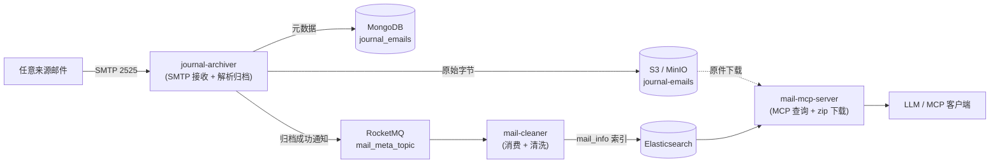

# 架构与设计

[← 返回文档索引](../README.md)

## 模块结构

三个应用基于 Spring Boot 3.4（JDK 17）构建，各自职责：

- **journal-archiver（归档应用）**：
  1. 内嵌 SMTP 服务，监听 `0.0.0.0`，接收来自任何来源的邮件；
  2. 识别 **journal 格式**（Exchange journal report）后，把原邮件基础信息写入 **MongoDB**
     （`_id` 为 `Base64(sender 邮箱地址)_Base64(Message-Id)`），原邮件原始字节写入 **S3 对象存储**
     （对象 key 与 MongoDB `_id` 相同），并计算原始字节的 **SHA-256**（`sha256`，小写 hex）
     一并存入 MongoDB；
  3. 两者都成功后向 **RocketMQ** `mail_meta_topic` 发送通知（消息 key 为 MongoDB `_id`）；
  4. 提供 HTTP 接口按时间范围或 `_id` 列表**重发**通知。
- **mail-cleaner（清洗应用）**：
  1. 订阅 RocketMQ `mail_meta_topic`；
  2. 收到消息后从对象存储读取邮件本体，解析出 sender / from / to / cc / Message-Id / ReceivedTime /
     subject / content-type / 所有附件名称，连同归档通知携带的 **sha256** 一起写入
     **Elasticsearch** 的 `mail_info` 索引；
  3. 提供 HTTP 接口按归档 id 从对象存储**下载邮件原件（.eml）**。
- **mail-mcp-server（MCP 查询应用）**：
  1. 基于 Spring MCP 系列依赖（`mcp-spring-webmvc`）提供**标准 MCP Streamable HTTP 接口**（`/mcp`）；
  2. 通过 MCP 工具从 **Elasticsearch** `mail_info` 索引查询归档邮件元数据
     （关键词 / 收发件人 / Message-Id / 时间范围检索、按 id 查询、计数），
     返回结果中包含原邮件的 `sha256`；
  3. 提供 HTTP 接口按归档 id 从对象存储批量下载邮件原件，打包为 `.zip` 返回。

```text
gas-town-mail（父 POM：统一依赖版本、编译参数、插件管理）
├── mail-common          共享模块
│   ├── config/          S3Properties、S3Config、JacksonConfig
│   ├── es/              MailInfoDocument（mail_info 索引文档模型，写入/查询共用）
│   ├── mail/            EmailDetailsExtractor、JournalDetector、OriginalEmailExtractor、
│   │                    EmailIdGenerator、MailMetaMessage 等
│   └── storage/         ObjectStorageService（S3 读写/删除）
├── journal-archiver     归档应用（SMTP + MongoDB + S3 + RocketMQ 生产者 + 重发接口）
├── mail-cleaner         清洗应用（RocketMQ 消费者 + S3 读 + Elasticsearch mail_info）
└── mail-mcp-server      MCP 查询应用（Spring MCP 标准接口 + Elasticsearch 查询 +
                         邮件原件批量 zip 下载）
```

三个应用通过共享模块 **mail-common** 复用邮件解析、S3 读写、ES 文档模型、公共配置等相同逻辑；
所有依赖版本统一在根 POM 的 `dependencyManagement` 中管理。

## 整体工作流程



单个应用的内部流程见各自的文档：

- [journal-archiver](journal-archiver.md#工作流程)
- [mail-cleaner](mail-cleaner.md#工作流程)
- [mail-mcp-server](mail-mcp-server.md#工作流程)

## 关键设计说明

### id 格式

```text
Base64(sender 邮箱地址)_Base64(Message-Id)
```

sender 只取**邮箱地址部分**：`Alice <alice@example.com>`、`<alice@example.com>`、
`alice@example.com (Alice)` 都按 `alice@example.com` 参与计算，因此同一发件人的不同写法
（显示名有无、多余空白）会得到同一个 id。

例如 `sender = Alice <alice@example.com>`、`Message-Id = <original-123@example.com>` 时：

```text
YWxpY2VAZXhhbXBsZS5jb20=_PG9yaWdpbmFsLTEyM0BleGFtcGxlLmNvbT4=
```

该值同时作为 MongoDB 文档 `_id` 和 S3 对象 key（`Content-Type: message/rfc822`）。

> 原邮件没有 `Message-Id` 且 `app.journal.generate-message-id-if-missing` 为 `false` 时，
> 第二段改用原邮件原始字节的 SHA-256 摘要，避免同一 sender 的多封无 Message-Id 邮件互相覆盖。

> 该规则在 1.2.0 之后变更：早期版本对完整 sender（含显示名）取 Base64，历史文档的 `_id`
> 仍是旧格式，不会自动迁移。若同一封旧邮件被重新投递，会按新规则生成新 `_id` 而产生重复文档。

### journal 格式识别

Exchange journal report 的典型特征（参考 Microsoft 文档）：

- 带有 `X-MS-Journal-Report` 头（投递到日记邮箱时添加）；
- 或带有 `X-MS-Exchange-Organization-Journal-Report` 头；
- 原始邮件以 `message/rfc822` 内嵌在 `multipart/mixed` 结构中。

默认命中上述任意一条即判定为 journal，可通过配置开关调整
（`app.journal.detect-by-header` / `detect-by-rfc822-attachment`）。

### “原邮件”的提取

- 若 journal 报告内嵌了 `message/rfc822` 部分，则归档**内嵌原始邮件**的原始字节，基础信息也从它解析；
- 若没有内嵌部分（或关闭 `extract-original-attachment`），则把收到的邮件本身视为原邮件归档。

### sender 与 from 的区别

按 RFC 5322 语义，`sender` 优先取原邮件的 `Sender` 头，缺省回退到 `From` 地址；
SMTP 信封发件人（MAIL FROM）单独存入 MongoDB 的 `envelopeSender` 字段。
如需直接用信封发件人作为 `sender`，可设置 `app.journal.sender-resolution: envelope`。

### 采集过滤

可在 `app.journal.filter` 下分别配置 sender / from / to / cc 的邮箱采集白名单，支持多个邮箱；
同一个字段命中列表中**任一**邮箱即可通过，四个字段之间为**与**关系。列表为空（或不配置）时，
该字段不参与筛选。过滤发生在写入 S3 / MongoDB / 发送通知之前，不满足条件的 journal 邮件会被跳过。

```yaml
app:
  journal:
    filter:
      sender-emails:
        - alice@example.com
        - bob@example.com
      from-emails: []
      to-emails:
        - carol@example.com
      cc-emails: []
```

匹配时忽略显示名与大小写，例如原邮件的 `From: Alice <alice@example.com>` 会被
`from-emails: [alice@example.com]` 命中。

完整的配置项说明见 [journal-archiver 配置](journal-archiver.md#配置applicationyml)。
